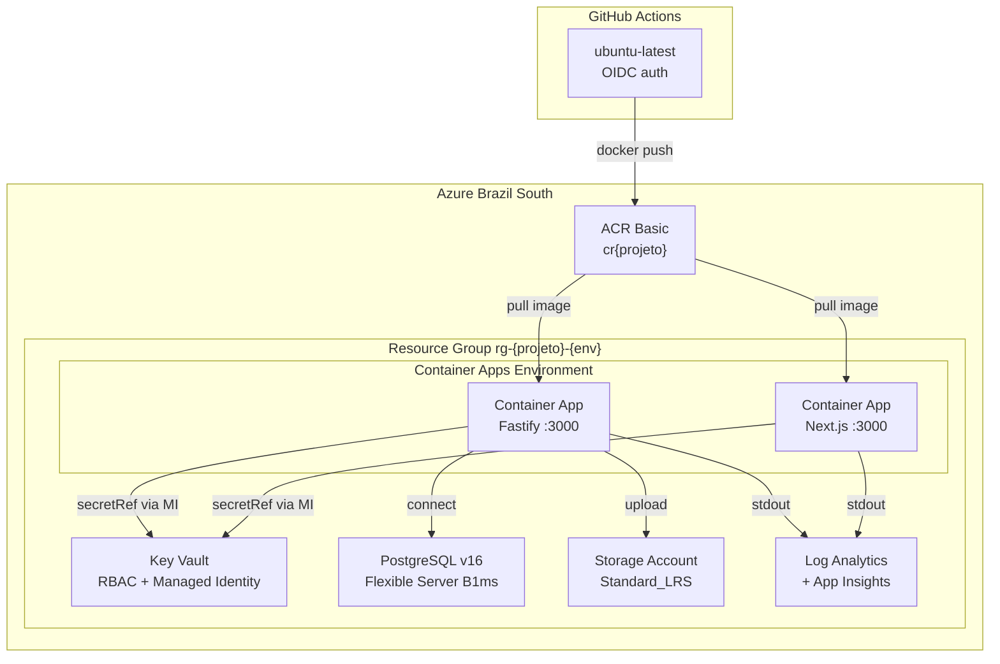

# Azure + Pulumi — Guia de Referencia

> Stack Fastify + Next.js + PostgreSQL na Azure com Pulumi TypeScript. Baseado em uma implementacao de referencia em producao. **Ultima Atualizacao:** 2026-04-08

## Indice

1. [Visao Geral](#1-visao-geral)
2. [Stack Tier — MVP ao Producao](#2-stack-tier--mvp-ao-producao)
3. [Estrutura do Repositorio Pulumi](#3-estrutura-do-repositorio-pulumi)
4. [Snippets Pulumi Essenciais](#4-snippets-pulumi-essenciais)
5. [Adaptacoes para Fastify](#5-adaptacoes-para-fastify)
6. [Adaptacoes para Next.js](#6-adaptacoes-para-nextjs)
7. [Dockerfile Multi-Stage](#7-dockerfile-multi-stage)
8. [CI/CD com GitHub Actions](#8-cicd-com-github-actions)
9. [Secrets Management](#9-secrets-management)
10. [Migrations PostgreSQL](#10-migrations-postgresql)
11. [Observabilidade Basica](#11-observabilidade-basica)
12. [Networking — MVP vs Evolucao](#12-networking--mvp-vs-evolucao)
13. [Custom Domain e TLS](#13-custom-domain-e-tls)
14. [Checklist Pre-Prod](#14-checklist-pre-prod)
15. [Armadilhas Conhecidas](#15-armadilhas-conhecidas)
16. [Roadmap de Evolucao](#16-roadmap-de-evolucao)
17. [Referencias](#17-referencias)

---

## 1. Visao Geral

Stack alvo: Fastify API + Next.js frontend, Azure Brazil South, PostgreSQL gerenciado, Container Apps para deploy sem Kubernetes, Key Vault para secrets, GitHub Actions com OIDC para CI/CD.

Filosofia: comecar com o tier mais simples possivel (sem VNet, sem private endpoints, sem Redis), evoluir conforme necessidade real.

### Por que Container Apps (e nao App Service / SWA / AKS)

| Opcao | Veredito | Motivo |
|-------|----------|--------|
| **Container Apps** | **Escolhido** | Suporta 100% das features do Next.js (SSR/ISR/Server Actions/Middleware), alinha API e Web no mesmo environment, scale-to-zero quase gratis em baixo trafico, IaC uniforme no Pulumi |
| App Service Linux | Descartado | Funciona, mas cria heterogeneidade (Fastify em CA + Next em AS), networking entre os dois fica mais caro/complexo, sem scale-to-zero (~$17-22/mes minimo no B1) |
| Static Web Apps (hybrid) | **Descartado** | Hybrid Next.js ainda em **preview** em 2026-01. Bloqueador: nao consegue linkar Container Apps como backend. ISR nao cacheia imagens. Limite 250 MB. Sem SLA de producao |
| AKS | Descartado | Overkill: ~$72/mes so de control plane + overhead operacional |
| Azure VM | Descartado | Sem valor — todo o overhead de OS/patching sem ganho |

> Fonte: [Microsoft Learn — Next.js on Static Web Apps](https://learn.microsoft.com/en-us/azure/static-web-apps/nextjs) (atualizado 2026-01-23) confirma status preview e a impossibilidade de linkar Container Apps como backend.



---

## 2. Stack Tier — MVP ao Producao

### Tier MVP (~$50-80/mes)

| Recurso | SKU | Custo/mes aprox | Quando upgradear |
|---------|-----|-----------------|------------------|
| Container Apps (API) | scale 0-2, 0.25 vCPU, 0.5 Gi | ~$5-15 (consumption) | Quando tiver trafego constante |
| Container Apps (Web) | scale 0-2, 0.25 vCPU, 0.5 Gi | ~$5-15 (consumption) | Idem |
| PostgreSQL Flexible | Burstable B1ms, 32GB, sem HA | ~$25 | Quando precisar de HA ou mais CPU |
| ACR | Basic | ~$5 | Quando precisar de geo-replication ou scanning |
| Key Vault | Standard | ~$0-1 | Nunca — Standard e suficiente |
| Storage Account | Standard_LRS | ~$2-5 | Quando precisar de GRS ou ADLS Gen2 |
| Log Analytics | PerGB2018, 0.5GB daily cap, 30 dias | ~$2-5 | Quando precisar de retencao maior |

**Sem Redis no MVP** — adicionar quando precisar de rate limiting ou cache distribuido.
**Sem VNet/Private Endpoints no MVP** — PostgreSQL com firewall rules e suficiente inicialmente.

### Tier Intermediario (~$120-180/mes)

| Recurso | Upgrade |
|---------|---------|
| Container Apps | scale 1-5, 0.5 vCPU, 1 Gi |
| PostgreSQL | Burstable B2ms ou General Purpose D2s_v3 |
| ACR | Basic → Standard (para geo-replication) |
| Log Analytics | daily cap 1GB |
| Redis | Basic C0 (rate limiting, cache) |

### Tier Producao (~$300-500/mes)

| Recurso | SKU Prod |
|---------|----------|
| Container Apps | scale 2-10, 1 vCPU, 2 Gi |
| PostgreSQL | General Purpose D4s_v3, ZoneRedundant HA, 35 dias backup geo-redundante |
| ACR | Premium (geo-replication, vulnerability scanning) |
| Storage | Standard_GRS |
| Redis | Standard C1 |
| VNet + Private Endpoints | KV, ACR, Postgres, Redis |
| Log Analytics | daily cap 5GB, 90 dias retencao |

---

## 3. Estrutura do Repositorio Pulumi

```
infra/
├── Pulumi.yaml
├── Pulumi.dev.yaml
├── Pulumi.prod.yaml
├── package.json
├── tsconfig.json
└── src/
    ├── index.ts            # exports do stack + ordem de imports
    ├── config.ts           # leitura de config por stack
    ├── resourceGroup.ts    # resource group base
    ├── identity.ts         # user-assigned managed identity + role assignments
    ├── keyVault.ts         # key vault + secrets (pulumi-managed e manuais)
    ├── containerRegistry.ts
    ├── postgres.ts         # postgresql flexible server + firewall rules + database
    ├── storage.ts          # storage account + blob containers
    ├── observability.ts    # log analytics + app insights
    ├── apiContainerApp.ts  # container app environment + container app da API
    ├── webContainerApp.ts  # container app do frontend Next.js
    └── network.ts          # opcional no MVP, necessario quando adicionar VNet
```

**`Pulumi.yaml`** (raiz):

```yaml
name: meu-projeto-infra
runtime:
  name: nodejs
  options:
    typescript: true
description: Infraestrutura Azure — Brazil South
```

**`Pulumi.dev.yaml`** (exemplo):

```yaml
config:
  azure-native:location: brazilsouth
  meu-projeto-infra:environment: dev
  meu-projeto-infra:dbSkuName: Standard_B1ms
  meu-projeto-infra:dbSkuTier: Burstable
  meu-projeto-infra:dbStorageSizeGb: "32"
  meu-projeto-infra:dbHaMode: Disabled
  meu-projeto-infra:dbBackupRetentionDays: "7"
  meu-projeto-infra:dbGeoRedundantBackup: Disabled
  meu-projeto-infra:containerCpu: "0.25"
  meu-projeto-infra:containerMemory: 0.5Gi
  meu-projeto-infra:containerMinReplicas: "0"
  meu-projeto-infra:containerMaxReplicas: "2"
  meu-projeto-infra:storageSkuName: Standard_LRS
  meu-projeto-infra:logAnalyticsDailyCapGb: "0.5"
  meu-projeto-infra:apiDomain: api-dev.seudominio.com
```

**`src/config.ts`**:

```typescript
import * as pulumi from '@pulumi/pulumi';

const config = new pulumi.Config('meu-projeto-infra');

export const environment = config.require('environment') as 'dev' | 'prod';
export const isProduction = environment === 'prod';

// Convencao: {tipo}-{projeto}-{env}
export function name(resource: string): string {
  return `${resource}-meuprojeto-${environment}`;
}

export const dbSkuName = config.require('dbSkuName');
export const dbSkuTier = config.require('dbSkuTier');
export const dbStorageSizeGb = config.requireNumber('dbStorageSizeGb');
export const dbHaMode = config.require('dbHaMode');
export const dbBackupRetentionDays = config.requireNumber('dbBackupRetentionDays');
export const dbGeoRedundantBackup = config.require('dbGeoRedundantBackup');
export const containerCpu = config.requireNumber('containerCpu');
export const containerMemory = config.require('containerMemory');
export const containerMinReplicas = config.requireNumber('containerMinReplicas');
export const containerMaxReplicas = config.requireNumber('containerMaxReplicas');
export const storageSkuName = config.require('storageSkuName');
export const logAnalyticsDailyCapGb = config.requireNumber('logAnalyticsDailyCapGb');
export const apiDomain = config.require('apiDomain');
export const containerImageTag = config.get('containerImageTag') || '';
```

---

## 4. Snippets Pulumi Essenciais

### Resource Group

```typescript
// src/resourceGroup.ts
import * as azure from '@pulumi/azure-native';
import { name } from './config';

export const resourceGroup = new azure.resources.ResourceGroup(name('rg'), {
  resourceGroupName: name('rg'),
  location: 'brazilsouth',
});
```

### Managed Identity + Role Assignments

```typescript
// src/identity.ts
import * as azure from '@pulumi/azure-native';
import * as pulumi from '@pulumi/pulumi';
import { name } from './config';
import { resourceGroup } from './resourceGroup';

export const managedIdentity = new azure.managedidentity.UserAssignedIdentity(
  name('id'),
  {
    resourceGroupName: resourceGroup.name,
    resourceName: name('id'),
  }
);

// Role IDs fixos da Azure (nao mudam entre subscriptions)
const ROLE_ACR_PULL = '7f951dda-4ed3-4680-a7ca-43fe172d538d';
const ROLE_KV_SECRETS_USER = '4633458b-17de-408a-b874-0445c86b69e6';
const ROLE_STORAGE_BLOB_CONTRIBUTOR = 'ba92f5b4-2d11-453d-a403-e96b0029c9fe';
const ROLE_KV_ADMINISTRATOR = '00482a5a-887f-4fb3-b363-3b7fe8e74483';

// Funcao auxiliar para criar role assignments
export function assignRole(
  name: string,
  principalId: pulumi.Input<string>,
  principalType: string,
  roleId: string,
  scope: pulumi.Input<string>
) {
  return new azure.authorization.RoleAssignment(name, {
    principalId,
    principalType,
    roleDefinitionId: `/providers/Microsoft.Authorization/roleDefinitions/${roleId}`,
    scope,
  });
}

export { ROLE_ACR_PULL, ROLE_KV_SECRETS_USER, ROLE_STORAGE_BLOB_CONTRIBUTOR, ROLE_KV_ADMINISTRATOR };
```

### ACR Basic

```typescript
// src/containerRegistry.ts
import * as azure from '@pulumi/azure-native';
import { name } from './config';
import { resourceGroup } from './resourceGroup';
import { managedIdentity, assignRole, ROLE_ACR_PULL } from './identity';

// Nome do ACR: 5-50 chars, lowercase alphanumeric apenas
const acrName = `crmeuprojeto`;

export const acr = new azure.containerregistry.Registry(acrName, {
  resourceGroupName: resourceGroup.name,
  registryName: acrName,
  sku: { name: 'Basic' },
  adminUserEnabled: true,
});

// Managed Identity pode fazer pull de imagens
assignRole(
  `${name('acr')}-pull`,
  managedIdentity.principalId,
  'ServicePrincipal',
  ROLE_ACR_PULL,
  acr.id
);
```

### Key Vault com RBAC

```typescript
// src/keyVault.ts
import * as azure from '@pulumi/azure-native';
import * as pulumi from '@pulumi/pulumi';
import * as random from '@pulumi/random';
import { name } from './config';
import { resourceGroup } from './resourceGroup';
import { managedIdentity, assignRole, ROLE_KV_SECRETS_USER, ROLE_KV_ADMINISTRATOR } from './identity';

export const keyVault = new azure.keyvault.Vault(name('kv'), {
  resourceGroupName: resourceGroup.name,
  vaultName: name('kv'),
  properties: {
    tenantId: managedIdentity.tenantId,
    sku: { family: 'A', name: azure.keyvault.SkuName.Standard },
    enableRbacAuthorization: true,
    enableSoftDelete: true,
    softDeleteRetentionInDays: 7,
    // CRITICO: manter defaultAction Allow — Deny bloqueia o control plane Azure
    // Seguranca via RBAC, nao via firewall de rede
    networkAcls: {
      defaultAction: azure.keyvault.NetworkRuleAction.Allow,
      bypass: azure.keyvault.NetworkRuleBypassOptions.AzureServices,
    },
  },
});

// Quem roda pulumi up ganha acesso de administrador (para popular secrets)
const clientConfig = pulumi.output(azure.authorization.getClientConfig());
assignRole(
  `${name('kv')}-admin`,
  clientConfig.objectId,
  'User',
  ROLE_KV_ADMINISTRATOR,
  keyVault.id
);

// Managed Identity so le secrets (nao administra)
assignRole(
  `${name('kv')}-secrets-user`,
  managedIdentity.principalId,
  'ServicePrincipal',
  ROLE_KV_SECRETS_USER,
  keyVault.id
);

// Senha do postgres gerenciada pelo Pulumi
export const postgresPassword = new random.RandomPassword(`${name('pg')}-password`, {
  length: 32,
  special: true,
  overrideSpecial: '!*()-_.',
});

// Secrets gerenciados pelo Pulumi (valores dinamicos/calculados)
new azure.keyvault.Secret(`${name('kv')}-postgres-password`, {
  resourceGroupName: resourceGroup.name,
  vaultName: keyVault.name,
  secretName: 'postgres-password',
  properties: { value: postgresPassword.result },
});

// Secrets manuais — Pulumi cria com placeholder, NUNCA sobrescreve valores reais
const manualSecretNames = ['app-secret-key', 'oauth-client-id', 'oauth-client-secret'];

for (const secretName of manualSecretNames) {
  new azure.keyvault.Secret(
    `${name('kv')}-${secretName}`,
    {
      resourceGroupName: resourceGroup.name,
      vaultName: keyVault.name,
      secretName,
      properties: { value: 'INITIAL_VALUE' },
    },
    // ignoreChanges e CRITICO: impede que pulumi up sobrescreva valores reais com INITIAL_VALUE
    { ignoreChanges: ['properties.value'] }
  );
}
```

### PostgreSQL Flexible Server

```typescript
// src/postgres.ts
import * as azure from '@pulumi/azure-native';
import * as pulumi from '@pulumi/pulumi';
import { name, environment, dbSkuName, dbSkuTier, dbStorageSizeGb, dbHaMode, dbBackupRetentionDays, dbGeoRedundantBackup } from './config';
import { resourceGroup } from './resourceGroup';
import { postgresPassword, keyVault } from './keyVault';

const dbName = `app_${environment}`;
const adminLogin = 'appAdmin';

export const postgresServer = new azure.dbforpostgresql.Server(
  name('pg'),
  {
    resourceGroupName: resourceGroup.name,
    serverName: name('pg'),
    version: '16' as azure.dbforpostgresql.ServerVersion,
    administratorLogin: adminLogin,
    administratorLoginPassword: postgresPassword.result,
    sku: {
      name: dbSkuName,
      tier: dbSkuTier as azure.dbforpostgresql.SkuTier,
    },
    storage: { storageSizeGB: dbStorageSizeGb },
    highAvailability: { mode: dbHaMode as azure.dbforpostgresql.HighAvailabilityMode },
    backup: {
      backupRetentionDays: dbBackupRetentionDays,
      geoRedundantBackup: dbGeoRedundantBackup as azure.dbforpostgresql.GeoRedundantBackupEnum,
    },
  },
  // deleteBeforeReplace evita conflito de nome durante replace
  { deleteBeforeReplace: true }
);

// Permitir conexoes de dentro da Azure (Container Apps, GitHub Actions)
new azure.dbforpostgresql.FirewallRule(`${name('pg')}-fw-azure`, {
  resourceGroupName: resourceGroup.name,
  serverName: postgresServer.name,
  firewallRuleName: 'AllowAzureServices',
  startIpAddress: '0.0.0.0',
  endIpAddress: '0.0.0.0',
});

// IP do desenvolvedor (substituir pelo IP real)
new azure.dbforpostgresql.FirewallRule(`${name('pg')}-fw-dev`, {
  resourceGroupName: resourceGroup.name,
  serverName: postgresServer.name,
  firewallRuleName: 'AllowDeveloperIP',
  startIpAddress: '0.0.0.0', // substituir pelo IP real
  endIpAddress: '0.0.0.0',
});

export const database = new azure.dbforpostgresql.Database(`${name('pg')}-db`, {
  resourceGroupName: resourceGroup.name,
  serverName: postgresServer.name,
  databaseName: dbName,
  charset: 'UTF8',
  collation: 'en_US.utf8',
});

// Connection string salva no Key Vault
export const databaseUrlSecret = new azure.keyvault.Secret(`${name('kv')}-database-url`, {
  resourceGroupName: resourceGroup.name,
  vaultName: keyVault.name,
  secretName: 'database-url',
  properties: {
    value: pulumi
      .all([postgresPassword.result, postgresServer.fullyQualifiedDomainName])
      .apply(([password, fqdn]) => {
        const encoded = encodeURIComponent(password);
        return `postgresql://${adminLogin}:${encoded}@${fqdn}:5432/${dbName}?sslmode=require`;
      }),
  },
});
```

### Storage Account

```typescript
// src/storage.ts
import * as azure from '@pulumi/azure-native';
import { name, storageSkuName } from './config';
import { resourceGroup } from './resourceGroup';
import { managedIdentity, assignRole, ROLE_STORAGE_BLOB_CONTRIBUTOR } from './identity';

// Nome: 3-24 chars, lowercase alphanumeric
const storageAccountName = `stmeuprojeto${name('').split('-').pop()}`;

export const storageAccount = new azure.storage.StorageAccount(name('st'), {
  resourceGroupName: resourceGroup.name,
  accountName: storageAccountName,
  kind: 'StorageV2',
  sku: { name: storageSkuName as azure.storage.SkuName },
  allowBlobPublicAccess: false,
  minimumTlsVersion: 'TLS1_2',
});

// Containers
for (const containerName of ['uploads', 'profile-photos']) {
  new azure.storage.BlobContainer(`${name('st')}-${containerName}`, {
    resourceGroupName: resourceGroup.name,
    accountName: storageAccount.name,
    containerName,
    publicAccess: 'None',
  });
}

// Managed Identity pode ler/escrever blobs
assignRole(
  `${name('st')}-blob-contributor`,
  managedIdentity.principalId,
  'ServicePrincipal',
  ROLE_STORAGE_BLOB_CONTRIBUTOR,
  storageAccount.id
);
```

### Log Analytics + Application Insights

```typescript
// src/observability.ts
import * as azure from '@pulumi/azure-native';
import { name, logAnalyticsDailyCapGb } from './config';
import { resourceGroup } from './resourceGroup';

export const logAnalyticsWorkspace = new azure.operationalinsights.Workspace(name('log'), {
  resourceGroupName: resourceGroup.name,
  workspaceName: name('log'),
  sku: { name: 'PerGB2018' },
  retentionInDays: 30,
  workspaceCapping: { dailyQuotaGb: logAnalyticsDailyCapGb },
});

export const appInsights = new azure.insights.Component(name('ai'), {
  resourceGroupName: resourceGroup.name,
  resourceName: name('ai'),
  kind: 'web',
  applicationType: 'web',
  workspaceResourceId: logAnalyticsWorkspace.id,
});
```

### Container Apps Environment + Container Apps

**CRITICO:** Importar de `@pulumi/azure-native/app/v20230501` e nao do modulo padrao. A versao padrao (`2022-10-01`) silenciosamente remove os campos `keyVaultUrl` e `identity` dos secrets, fazendo o Container App nao conseguir acessar o Key Vault. Ver [armadilha #1](#15-armadilhas-conhecidas).

```typescript
// src/apiContainerApp.ts
import * as pulumi from '@pulumi/pulumi';
import * as azure from '@pulumi/azure-native';
// CRITICO: usar versao 20230501, NAO o modulo padrao
import * as appV2 from '@pulumi/azure-native/app/v20230501';
import { name, containerCpu, containerMemory, containerMinReplicas, containerMaxReplicas, apiDomain, containerImageTag } from './config';
import { resourceGroup } from './resourceGroup';
import { managedIdentity, acr } from './identity'; // ajuste os imports conforme sua estrutura
import { keyVault } from './keyVault';
import { logAnalyticsWorkspace } from './observability';

// Container Apps Environment (sem VNet no MVP)
export const containerAppEnv = new appV2.ManagedEnvironment(name('cae'), {
  resourceGroupName: resourceGroup.name,
  environmentName: name('cae'),
  appLogsConfiguration: {
    destination: 'log-analytics',
    logAnalyticsConfiguration: {
      customerId: logAnalyticsWorkspace.customerId,
      sharedKey: pulumi
        .all([resourceGroup.name, logAnalyticsWorkspace.name])
        .apply(([rgName, wsName]) =>
          azure.operationalinsights
            .getSharedKeys({ resourceGroupName: rgName, workspaceName: wsName })
            .then((keys) => keys.primarySharedKey ?? '')
        ),
    },
  },
});

// Monta o array de secrets apontando para o Key Vault via Managed Identity
const kvSecretNames = ['database-url', 'app-secret-key', 'oauth-client-id', 'oauth-client-secret'];

const containerAppSecrets = pulumi
  .all([keyVault.name, managedIdentity.id])
  .apply(([vaultName, identityId]) =>
    kvSecretNames.map((secretName) => ({
      name: secretName,
      keyVaultUrl: `https://${vaultName}.vault.azure.net/secrets/${secretName}`,
      identity: identityId,
    }))
  );

// Container App da API Fastify
export const apiContainerApp = new appV2.ContainerApp(name('ca-api'), {
  resourceGroupName: resourceGroup.name,
  containerAppName: `ca-meuprojeto-api-${name('').split('-').pop()}`,
  managedEnvironmentId: containerAppEnv.id,
  identity: {
    type: 'UserAssigned',
    userAssignedIdentities: [managedIdentity.id],
  },
  configuration: {
    activeRevisionsMode: 'Single',
    ingress: {
      external: true,
      targetPort: 3000,
      transport: 'auto',
      allowInsecure: false,
    },
    secrets: containerAppSecrets,
    registries: [
      {
        server: acr.loginServer,
        identity: managedIdentity.id,
      },
    ],
  },
  template: {
    containers: [
      {
        name: 'api',
        image: containerImageTag
          ? pulumi.interpolate`${acr.loginServer}/meuprojeto-api:${containerImageTag}`
          : 'mcr.microsoft.com/k8se/quickstart:latest',
        resources: {
          cpu: containerCpu,
          memory: containerMemory,
        },
        env: [
          { name: 'DATABASE_URL', secretRef: 'database-url' },
          { name: 'APP_SECRET_KEY', secretRef: 'app-secret-key' },
          { name: 'NODE_ENV', value: 'production' },
          { name: 'PORT', value: '3000' },
        ],
        probes: [
          {
            type: 'Liveness',
            httpGet: { path: '/health', port: 3000 },
            periodSeconds: 30,
            failureThreshold: 3,
          },
          {
            type: 'Readiness',
            httpGet: { path: '/health/ready', port: 3000 },
            periodSeconds: 10,
            failureThreshold: 3,
          },
          {
            // Startup probe longo: cold start com migrations pode levar >30s
            type: 'Startup',
            httpGet: { path: '/health', port: 3000 },
            periodSeconds: 10,
            failureThreshold: 6,
            timeoutSeconds: 60,
          },
        ],
      },
    ],
    scale: {
      minReplicas: containerMinReplicas,
      maxReplicas: containerMaxReplicas,
    },
  },
});
```

Container App do Next.js (sem probes de startup longas, sem migrations):

```typescript
// src/webContainerApp.ts — exemplo simplificado
export const webContainerApp = new appV2.ContainerApp(name('ca-web'), {
  resourceGroupName: resourceGroup.name,
  containerAppName: `ca-meuprojeto-web-${name('').split('-').pop()}`,
  managedEnvironmentId: containerAppEnv.id,
  identity: {
    type: 'UserAssigned',
    userAssignedIdentities: [managedIdentity.id],
  },
  configuration: {
    activeRevisionsMode: 'Single',
    ingress: { external: true, targetPort: 3000, transport: 'auto', allowInsecure: false },
    secrets: containerAppSecrets, // apenas os secrets necessarios para o web
    registries: [{ server: acr.loginServer, identity: managedIdentity.id }],
  },
  template: {
    containers: [
      {
        name: 'web',
        image: containerImageTag
          ? pulumi.interpolate`${acr.loginServer}/meuprojeto-web:${containerImageTag}`
          : 'mcr.microsoft.com/k8se/quickstart:latest',
        resources: { cpu: containerCpu, memory: containerMemory },
        env: [
          { name: 'NODE_ENV', value: 'production' },
          { name: 'PORT', value: '3000' },
          // NEXT_PUBLIC_* embutidas no build — passar via build arg, nao aqui
          { name: 'INTERNAL_API_URL', value: 'http://api-container-app-fqdn' },
        ],
        probes: [
          {
            type: 'Liveness',
            httpGet: { path: '/api/health', port: 3000 },
            periodSeconds: 30,
            failureThreshold: 3,
          },
        ],
      },
    ],
    scale: { minReplicas: 0, maxReplicas: 2 },
  },
});
```

---

## 5. Adaptacoes para Fastify

### Healthcheck endpoints

Container Apps requer endpoints de health. Fastify precisa registrar explicitamente:

```typescript
// src/health.ts
import { FastifyInstance } from 'fastify';

export async function healthRoutes(app: FastifyInstance) {
  // Liveness: container esta vivo?
  app.get('/health', async () => ({ status: 'ok', timestamp: new Date().toISOString() }));

  // Readiness: container esta pronto para receber trafego?
  app.get('/health/ready', async (req, reply) => {
    try {
      // verificar conexao com banco
      await db.execute(sql`SELECT 1`);
      return { status: 'ready' };
    } catch (err) {
      return reply.code(503).send({ status: 'not ready', error: String(err) });
    }
  });
}
```

### Configuracao do servidor

```typescript
// src/server.ts
const app = fastify({
  logger: {
    // pino JSON — capturado automaticamente pelo Log Analytics
    level: process.env.LOG_LEVEL ?? 'info',
  },
});

await app.listen({
  port: Number(process.env.PORT ?? 3000),
  // OBRIGATORIO em container: default do Fastify e '127.0.0.1', nao funciona
  host: '0.0.0.0',
});

// Graceful shutdown — Container Apps envia SIGTERM antes de matar o container
const gracefulShutdown = async (signal: string) => {
  app.log.info({ signal }, 'Shutting down');
  await app.close();
  process.exit(0);
};

process.on('SIGTERM', () => gracefulShutdown('SIGTERM'));
process.on('SIGINT', () => gracefulShutdown('SIGINT'));
```

**Pontos criticos:**
- `host: '0.0.0.0'` e obrigatorio — sem isso o container sobe mas nao responde
- Pino com `{ level: 'info' }` emite JSON estruturado para stdout → Log Analytics captura automaticamente
- `SIGTERM` handler garante que conexoes em andamento terminam antes do container morrer

---

## 6. Adaptacoes para Next.js

### Build standalone

```javascript
// next.config.js
/** @type {import('next').NextConfig} */
const nextConfig = {
  // OBRIGATORIO para Docker: gera .next/standalone com node_modules minimos
  output: 'standalone',
};

module.exports = nextConfig;
```

### Healthcheck endpoint

```typescript
// app/api/health/route.ts
import { NextResponse } from 'next/server';

export async function GET() {
  return NextResponse.json({ status: 'ok' }, { status: 200 });
}
```

### Variaveis de ambiente

| Tipo | Prefixo | Quando e embutida | Como passar |
|------|---------|------------------|-------------|
| Publica (cliente) | `NEXT_PUBLIC_*` | No build (imagem Docker) | Docker build arg |
| Privada (servidor) | sem prefixo | Nunca (runtime) | env var no Container App |

**CRITICO:** `NEXT_PUBLIC_*` sao embutidas na imagem durante `npm run build`. Mudar o valor requer rebuild da imagem. Usar apenas para coisas realmente publicas (ex: URL da API, analytics ID).

```dockerfile
# Passar vars publicas como build args
ARG NEXT_PUBLIC_API_URL
ENV NEXT_PUBLIC_API_URL=$NEXT_PUBLIC_API_URL
RUN npm run build
```

No workflow de CI:
```yaml
- name: Build and push
  uses: docker/build-push-action@v6
  with:
    build-args: |
      NEXT_PUBLIC_API_URL=https://api.seudominio.com
```

### Gotchas especificas de Next.js em Container Apps

Estas armadilhas nao afetam outras plataformas (Vercel, App Service), apenas o combo Next.js + Container Apps. Leia antes de subir o primeiro deploy.

#### 1. `HOSTNAME=0.0.0.0` obrigatorio no Dockerfile

Next.js standalone por padrao faz bind em `localhost`. Container Apps roteia o trafego via sidecar e **nunca alcanca o processo** — o deploy sobe, probes falham silenciosamente, voce vai receber **502 persistente sem erro claro nos logs**.

Solucao no Dockerfile (stage `runner`):
```dockerfile
ENV HOSTNAME=0.0.0.0
ENV PORT=3000
```

Este e o equivalente do `host: '0.0.0.0'` no Fastify, mas se aplica via env var porque o `server.js` do standalone le `process.env.HOSTNAME`.

#### 2. ISR com multiplas replicas = cache inconsistente

O cache de ISR do Next.js e **local por instancia** (filesystem). Com `minReplicas > 1`, cada replica mantem sua propria versao do cache e serve conteudo stale diferente ate revalidar. O usuario final ve pagina A numa requisicao e pagina B na proxima.

Solucoes:
- **MVP / 1 replica:** ignorar, nao e problema real
- **Multi-replica:** implementar `cacheHandler` customizado apontando para Redis (Azure Cache for Redis no tier evolucao)
- **Alternativa:** usar apenas SSR puro (sem ISR), aceitando o custo de renderizar toda requisicao

Config no `next.config.js` quando precisar:
```javascript
module.exports = {
  output: 'standalone',
  cacheHandler: require.resolve('./cache-handler.js'),
  cacheMaxMemorySize: 0, // desabilita cache em memoria, usa so o handler
};
```

#### 3. Scale-to-zero quebra OAuth callbacks

Com `minReplicas: 0` (scale-to-zero), o container desliga apos ~5min de idle. Se o usuario iniciar um OAuth flow (Google, GitHub, etc.) e o redirect voltar com o container cold, o cold start (3-8s) pode exceder o timeout do provider OU a state/PKCE armazenada localmente se perde.

Decisao:
- **Sem auth OAuth:** `minReplicas: 0` tranquilo
- **Com auth OAuth ou webhook publico:** `minReplicas: 1` (custa ~$5-15/mes idle mas elimina o problema)

#### 4. Trade-off explicito `minReplicas` 0 vs 1

| `minReplicas` | Cold start | Custo idle | Recomendado para |
|---------------|------------|------------|------------------|
| `0` | 3-8s na primeira requisicao apos idle | ~$0 (provavelmente dentro do free tier) | Landing pages, projetos pessoais, ambientes dev |
| `1` | Nenhum | ~$5-15/mes (idle rate Container Apps) | Qualquer app com auth, webhook, ou UX sensivel a latencia |

#### 5. Healthcheck probe no Pulumi

Next.js nao tem rota de health built-in — a rota `app/api/health/route.ts` mostrada acima deve ser referenciada no probe do Container App. Ver snippet no [item 4.8 da secao 4](#48-container-apps-environment--container-apps-api--web).

---

## 7. Dockerfile Multi-Stage

### API (Fastify)

```dockerfile
# Stage 1: dependencias de producao
FROM node:22-alpine AS deps
WORKDIR /app
COPY package*.json ./
RUN --mount=type=cache,target=/root/.npm npm ci --omit=dev

# Stage 2: build
FROM node:22-alpine AS builder
WORKDIR /app
COPY package*.json ./
RUN --mount=type=cache,target=/root/.npm npm ci
COPY . .
RUN npm run build

# Stage 3: runner (imagem final, menor possivel)
FROM node:22-alpine AS runner
WORKDIR /app
# usuario nao-root obrigatorio (seguranca)
RUN addgroup -S app && adduser -S app -G app
COPY --from=deps /app/node_modules ./node_modules
COPY --from=builder /app/dist ./dist
USER app
EXPOSE 3000
ENV NODE_ENV=production
ENV PORT=3000
CMD ["node", "dist/server.js"]
```

### Web (Next.js standalone)

```dockerfile
FROM node:22-alpine AS deps
WORKDIR /app
COPY package*.json ./
RUN --mount=type=cache,target=/root/.npm npm ci

FROM node:22-alpine AS builder
WORKDIR /app
COPY --from=deps /app/node_modules ./node_modules
COPY . .
# vars publicas injetadas no build
ARG NEXT_PUBLIC_API_URL
ENV NEXT_PUBLIC_API_URL=$NEXT_PUBLIC_API_URL
RUN npm run build

FROM node:22-alpine AS runner
WORKDIR /app
ENV NODE_ENV=production
# CRITICO: sem HOSTNAME=0.0.0.0 o standalone faz bind em localhost e Container
# Apps devolve 502 silencioso. Ver gotcha #1 na secao 6.
ENV HOSTNAME=0.0.0.0
ENV PORT=3000
RUN addgroup -S app && adduser -S app -G app
# standalone inclui apenas o necessario para rodar
COPY --from=builder /app/.next/standalone ./
COPY --from=builder /app/.next/static ./.next/static
COPY --from=builder /app/public ./public
USER app
EXPOSE 3000
CMD ["node", "server.js"]
```

### .dockerignore minimo

```
node_modules
.next
.git
.env*
*.md
coverage
.DS_Store
```

---

## 8. CI/CD com GitHub Actions

### Configurar OIDC (passo a passo)

1. No Azure Portal: Azure Active Directory → App registrations → New registration
   - Nome: `github-meuprojeto`
   - Tipo: Accounts in this organization only

2. Na app registration criada: Certificates & secrets → Federated credentials → Add credential
   - Issuer: `https://token.actions.githubusercontent.com`
   - Subject: `repo:OWNER/REPO:ref:refs/heads/main`
   - Audience: `api://AzureADTokenExchange`
   - Para prod environment: subject `repo:OWNER/REPO:environment:production`

3. Copiar: Application (client) ID, Directory (tenant) ID

4. No Azure: Subscriptions → Access control → Add role assignment
   - Role: `Contributor` no resource group
   - Role: `AcrPush` no ACR

5. No GitHub: Settings → Secrets and variables → Actions
   - `AZURE_CLIENT_ID` — Application (client) ID
   - `AZURE_TENANT_ID` — Directory (tenant) ID
   - `AZURE_SUBSCRIPTION_ID` — Subscription ID

### Workflow: deploy-api.yml

```yaml
name: Deploy API

on:
  push:
    branches: [main]
    paths:
      - 'apps/api/**'
      - 'package*.json'

concurrency:
  group: deploy-api
  cancel-in-progress: false

permissions:
  id-token: write
  contents: read

env:
  ACR_NAME: crmeuprojeto
  CONTAINER_APP_NAME: ca-meuprojeto-api-prod
  RESOURCE_GROUP: rg-meuprojeto-prod
  IMAGE_NAME: meuprojeto-api

jobs:
  build-and-push:
    runs-on: ubuntu-latest
    environment: production
    timeout-minutes: 15
    outputs:
      image_tag: ${{ steps.tag.outputs.image_tag }}
    steps:
      - uses: actions/checkout@v4

      - name: Azure Login (OIDC)
        uses: azure/login@v2
        with:
          client-id: ${{ secrets.AZURE_CLIENT_ID }}
          tenant-id: ${{ secrets.AZURE_TENANT_ID }}
          subscription-id: ${{ secrets.AZURE_SUBSCRIPTION_ID }}

      - name: Login to ACR
        run: az acr login --name ${{ env.ACR_NAME }}

      - uses: docker/setup-buildx-action@v3

      - name: Build and push
        uses: docker/build-push-action@v6
        with:
          context: .
          file: apps/api/Dockerfile
          push: true
          tags: |
            ${{ env.ACR_NAME }}.azurecr.io/${{ env.IMAGE_NAME }}:${{ github.sha }}
            ${{ env.ACR_NAME }}.azurecr.io/${{ env.IMAGE_NAME }}:latest
          cache-from: type=gha
          cache-to: type=gha,mode=max

      - id: tag
        run: echo "image_tag=${{ env.ACR_NAME }}.azurecr.io/${{ env.IMAGE_NAME }}:${{ github.sha }}" >> $GITHUB_OUTPUT

  deploy:
    runs-on: ubuntu-latest
    needs: build-and-push
    environment: production
    timeout-minutes: 10
    steps:
      - name: Azure Login (OIDC)
        uses: azure/login@v2
        with:
          client-id: ${{ secrets.AZURE_CLIENT_ID }}
          tenant-id: ${{ secrets.AZURE_TENANT_ID }}
          subscription-id: ${{ secrets.AZURE_SUBSCRIPTION_ID }}

      - name: Deploy
        run: |
          az containerapp update \
            --name ${{ env.CONTAINER_APP_NAME }} \
            --resource-group ${{ env.RESOURCE_GROUP }} \
            --image "${{ needs.build-and-push.outputs.image_tag }}"

      - name: Poll revision status
        run: |
          # az containerapp update retorna antes do container estar saudavel
          # polling e obrigatorio para detectar falhas de startup
          for i in $(seq 1 18); do
            REVISION=$(az containerapp revision list \
              --name ${{ env.CONTAINER_APP_NAME }} \
              --resource-group ${{ env.RESOURCE_GROUP }} \
              --query "sort_by(@, &properties.createdTime)[-1].name" -o tsv)
            STATUS=$(az containerapp revision show \
              --name ${{ env.CONTAINER_APP_NAME }} \
              --resource-group ${{ env.RESOURCE_GROUP }} \
              --revision "$REVISION" \
              --query "properties.runningState" -o tsv 2>/dev/null || echo "unknown")
            echo "Attempt $i: $STATUS"
            [ "$STATUS" = "Running" ] && break
            [ "$STATUS" = "Failed" ] && exit 1
            sleep 10
          done

      - name: Health check
        run: |
          FQDN=$(az containerapp show \
            --name ${{ env.CONTAINER_APP_NAME }} \
            --resource-group ${{ env.RESOURCE_GROUP }} \
            --query properties.configuration.ingress.fqdn -o tsv)
          for i in 1 2 3 4 5; do
            STATUS=$(curl -s -o /dev/null -w "%{http_code}" --max-time 30 "https://$FQDN/health" || true)
            [ "$STATUS" = "200" ] && echo "Health check passed" && exit 0
            echo "Attempt $i: HTTP $STATUS"
            sleep 15
          done
          exit 1
```

### Workflow: deploy-infra.yml

```yaml
name: Deploy Infrastructure

on:
  push:
    branches: [main]
    paths: ['infra/**']
  workflow_dispatch:

permissions:
  id-token: write
  contents: read

jobs:
  deploy:
    runs-on: ubuntu-latest
    environment: production
    timeout-minutes: 30
    steps:
      - uses: actions/checkout@v4
      - uses: actions/setup-node@v4
        with:
          node-version: 22
          cache: npm
      - run: npm ci --workspace=infra

      - uses: azure/login@v2
        with:
          client-id: ${{ secrets.AZURE_CLIENT_ID }}
          tenant-id: ${{ secrets.AZURE_TENANT_ID }}
          subscription-id: ${{ secrets.AZURE_SUBSCRIPTION_ID }}

      - uses: pulumi/actions@v5
        with:
          command: preview
          stack-name: myorg/prod
          work-dir: infra
        env:
          PULUMI_ACCESS_TOKEN: ${{ secrets.PULUMI_ACCESS_TOKEN }}
          ARM_USE_OIDC: 'true'
          ARM_CLIENT_ID: ${{ secrets.AZURE_CLIENT_ID }}
          ARM_TENANT_ID: ${{ secrets.AZURE_TENANT_ID }}
          ARM_SUBSCRIPTION_ID: ${{ secrets.AZURE_SUBSCRIPTION_ID }}

      - uses: pulumi/actions@v5
        with:
          command: up
          stack-name: myorg/prod
          work-dir: infra
        env:
          PULUMI_ACCESS_TOKEN: ${{ secrets.PULUMI_ACCESS_TOKEN }}
          ARM_USE_OIDC: 'true'
          ARM_CLIENT_ID: ${{ secrets.AZURE_CLIENT_ID }}
          ARM_TENANT_ID: ${{ secrets.AZURE_TENANT_ID }}
          ARM_SUBSCRIPTION_ID: ${{ secrets.AZURE_SUBSCRIPTION_ID }}
```

### Workflow: db-migration.yml

```yaml
name: Database Migration

on:
  workflow_dispatch:
    inputs:
      dry-run:
        description: 'Dry run (preview sem aplicar)'
        required: true
        default: true
        type: boolean

permissions:
  id-token: write
  contents: read

jobs:
  migrate:
    runs-on: ubuntu-latest
    environment: production
    steps:
      - uses: azure/login@v2
        with:
          client-id: ${{ secrets.AZURE_CLIENT_ID }}
          tenant-id: ${{ secrets.AZURE_TENANT_ID }}
          subscription-id: ${{ secrets.AZURE_SUBSCRIPTION_ID }}

      - name: Dry run
        if: inputs.dry-run
        run: |
          az containerapp exec \
            --name ca-meuprojeto-api-prod \
            --resource-group rg-meuprojeto-prod \
            --command "npx drizzle-kit check"

      - name: Apply migrations
        if: ${{ !inputs.dry-run }}
        run: |
          az containerapp exec \
            --name ca-meuprojeto-api-prod \
            --resource-group rg-meuprojeto-prod \
            --command "npx drizzle-kit migrate"
```

---

## 9. Secrets Management

### Dois padroes

| Tipo | Exemplos | Como o Pulumi gerencia |
|------|----------|----------------------|
| Pulumi-managed | `database-url`, `postgres-password`, URLs calculadas | Valor gerado/calculado pelo Pulumi, salvo no KV |
| Manual | OAuth keys, API keys de terceiros, chave de criptografia | Pulumi cria com `INITIAL_VALUE`, desenvolvedor popula manualmente |

**Por que dois padroes:** secrets calculados (como a connection string do banco) dependem de outputs do Pulumi e sao gerados automaticamente. Secrets de terceiros (OAuth, Stripe, etc.) nao podem estar no codigo e sao populados via CLI ou script.

### ignoreChanges para secrets manuais

```typescript
new azure.keyvault.Secret(
  `${name('kv')}-api-key`,
  {
    resourceGroupName: resourceGroup.name,
    vaultName: keyVault.name,
    secretName: 'api-key',
    properties: { value: 'INITIAL_VALUE' }, // placeholder inicial
  },
  // SEM isso: pulumi up sempre sobrescreve o valor real com INITIAL_VALUE
  { ignoreChanges: ['properties.value'] }
);
```

### Como popular secrets manuais

Via CLI apos o primeiro `pulumi up`:

```bash
# Popular um secret
az keyvault secret set \
  --vault-name kv-meuprojeto-prod \
  --name api-key \
  --value "valor-real-aqui"

# Verificar todos os secrets obrigatorios
for s in app-secret-key oauth-client-id oauth-client-secret; do
  echo "$s: $(az keyvault secret show --vault-name kv-meuprojeto-prod --name $s --query value -o tsv)"
done
```

Via script (padrao `sync-secrets.sh` em `scripts/infra/`):

```bash
# Cria .env.secrets com os valores e sincroniza para o Key Vault
# Converte KEY_NAME → key-name automaticamente
# So atualiza os que mudaram

./scripts/infra/sync-secrets.sh prod .env.secrets
```

### Recarregar secrets sem rebuild Docker

Mudanca de secret nao requer rebuild da imagem — o Container App so precisa de uma nova revision:

```bash
# Forca nova revision injetando timestamp (padrao reload-secrets.sh)
az containerapp update \
  --name ca-meuprojeto-api-prod \
  --resource-group rg-meuprojeto-prod \
  --set-env-vars "SECRET_RELOAD_TIMESTAMP=$(date +%s)"
```

---

## 10. Migrations PostgreSQL

### Padrao A: Migrations no entrypoint (MVP)

Mais simples. Migrations rodam toda vez que o container sobe. Ideal para times pequenos com deploys infrequentes.

```sh
#!/bin/sh
# apps/api/scripts/entrypoint.sh
set -e

echo "[entrypoint] Running migrations..."
node dist/scripts/migrate.js

echo "[entrypoint] Starting server..."
exec node dist/server.js
```

**Risco:** se a migration falha, o container nao sobe e o health check falha. Isso e intencional — falha cedo e explicitamente. Configurar startup probe com timeout generoso (ver secao 4).

### Padrao B: Job separado via az containerapp exec (recomendado para prod)

Migrations rodam dentro do container vivo sem criar nova revision. Permite validar antes de aplicar.

```bash
# dry-run: verificar se migrations estao sincronizadas
az containerapp exec \
  --name ca-meuprojeto-api-prod \
  --resource-group rg-meuprojeto-prod \
  --command "npx drizzle-kit check"

# aplicar
az containerapp exec \
  --name ca-meuprojeto-api-prod \
  --resource-group rg-meuprojeto-prod \
  --command "npx drizzle-kit migrate"
```

**Vantagem:** migrations nao bloqueiam o deploy da nova imagem. O container velho roda a migration e depois o novo container sobe sem migrations no entrypoint.

### CI de validacao de migrations

Antes de criar uma PR, validar que a migration nao vai quebrar:

```yaml
# .github/workflows/db-migration-ci.yml
- name: Check migrations compile
  run: npx drizzle-kit check --config drizzle.config.ts

- name: Apply migrations in CI
  run: |
    # sobe postgres local via docker, aplica migrations, verifica schema
    docker run -d -p 5432:5432 -e POSTGRES_PASSWORD=test postgres:16-alpine
    npx drizzle-kit migrate
    npx drizzle-kit check
```

---

## 11. Observabilidade Basica

### Logs automaticos

Container Apps captura tudo que vai para stdout/stderr e envia para o Log Analytics configurado no Container Apps Environment. Nenhuma configuracao extra no codigo.

Com Fastify + Pino (JSON por padrao), os logs aparecem estruturados no Log Analytics.

### Queries uteis no Log Analytics

```kusto
-- Erros nas ultimas 1h
ContainerAppConsoleLogs_CL
| where TimeGenerated > ago(1h)
| where Log_s contains "ERROR" or Log_s contains "FATAL"
| order by TimeGenerated desc
| take 50

-- Requests com latencia > 1s
AppRequests
| where TimeGenerated > ago(1h)
| where DurationMs > 1000
| summarize count() by Name, bin(TimeGenerated, 5m)

-- Restarts do container
ContainerAppSystemLogs_CL
| where Reason_s == "BackOff"
| order by TimeGenerated desc
```

### Application Insights (opcional no MVP)

Para tracing distribuido, adicionar o SDK:

```bash
npm install @opentelemetry/sdk-node @azure/monitor-opentelemetry-exporter
```

Configurar antes de qualquer import:

```typescript
// instrumentation.ts (carregado antes do server.ts)
import { useAzureMonitor } from '@azure/monitor-opentelemetry';

useAzureMonitor({
  azureMonitorExporterOptions: {
    connectionString: process.env.APPLICATIONINSIGHTS_CONNECTION_STRING,
  },
});
```

---

## 12. Networking — MVP vs Evolucao

### MVP (sem VNet)

- Container Apps Environment "Consumption only" sem VNet
- PostgreSQL Flexible Server public com firewall rules
  - `0.0.0.0 - 0.0.0.0`: permite conexoes de dentro da Azure
  - IP do dev: permite acesso direto para desenvolvimento
- Key Vault com `defaultAction: Allow` + RBAC

**Custo adicional de VNet:** ~$0 (subnets sao gratuitas), mas Private Endpoints custam ~$7/mes cada.

### Quando adicionar VNet

Quando tiver dados sensiveis ou requisito de compliance. Sequencia recomendada:

1. Criar VNet + subnets (api `/23`, db `/24`, pep `/24`)
2. Associar Container Apps Environment a subnet api (delegation obrigatoria)
3. Criar Private Endpoint para PostgreSQL + Private DNS Zone
4. Desabilitar public access no PostgreSQL
5. Repetir para Key Vault e ACR

**CRITICO:** PostgreSQL nao permite mudar de public para private apos criacao. Requer destruir o servidor manualmente e rodar `pulumi up --refresh`. Ver [armadilha #3](#15-armadilhas-conhecidas).

### Snippet VNet (para quando evoluir)

```typescript
// src/network.ts
import * as azure from '@pulumi/azure-native';
import { name } from './config';
import { resourceGroup } from './resourceGroup';

export const vnet = new azure.network.VirtualNetwork(name('vnet'), {
  resourceGroupName: resourceGroup.name,
  virtualNetworkName: name('vnet'),
  addressSpace: { addressPrefixes: ['10.0.0.0/16'] },
});

const apiNsg = new azure.network.NetworkSecurityGroup(`${name('nsg')}-api`, {
  resourceGroupName: resourceGroup.name,
  networkSecurityGroupName: `${name('nsg')}-api`,
});

// CRITICO: NSG criado mas nao associado = inefetivo
// Sempre setar networkSecurityGroup em cada Subnet
export const apiSubnet = new azure.network.Subnet(`${name('snet')}-api`, {
  resourceGroupName: resourceGroup.name,
  virtualNetworkName: vnet.name,
  subnetName: 'snet-api',
  addressPrefix: '10.0.0.0/23',
  networkSecurityGroup: { id: apiNsg.id }, // associacao obrigatoria
  delegations: [
    {
      name: 'Microsoft.App.environments',
      serviceName: 'Microsoft.App/environments',
    },
  ],
});

// CRITICO: Private DNS Zone naming — usar split('.')[1], NAO split('.')[0]
// split('.')[0] retorna 'privatelink' para TODAS as zonas → URN duplicado
const zoneName = 'privatelink.postgres.database.azure.com';
const shortName = `pdz-${zoneName.split('.')[1]}`; // 'pdz-postgres', NAO 'pdz-privatelink'
```

---

## 13. Custom Domain e TLS

### Configurar CNAME

No DNS provider (Cloudflare, Route53, etc.):
```
api.seudominio.com  CNAME  <fqdn-do-container-app>.brazilsouth.azurecontainerapps.io
```

**Se usar Cloudflare:** configurar DNS-only (laranja desligado) durante provisionamento do ManagedCertificate. O Azure precisa fazer HTTP challenge direto.

### Snippet Pulumi para custom domain

```typescript
// Requer que o CNAME ja exista antes de rodar pulumi up
// Azure valida o CNAME durante provisionamento do certificado
const managedCert = new appV2.ManagedCertificate(
  name('mc'),
  {
    resourceGroupName: resourceGroup.name,
    environmentName: containerAppEnv.name,
    managedCertificateName: 'api.seudominio.com-cert',
    properties: {
      subjectName: apiDomain,
      domainControlValidation: 'CNAME',
    },
  },
  // provisionamento pode levar ate 20min
  { customTimeouts: { create: '20m' } }
);

// No ingress do Container App
// CRITICO: sempre incluir customDomains ao rodar pulumi up
// Se omitir, Pulumi remove o custom domain do Container App
ingress: {
  external: true,
  targetPort: 3000,
  transport: 'auto',
  allowInsecure: false,
  customDomains: [
    {
      name: apiDomain,
      certificateId: managedCert.id,
      bindingType: 'SniEnabled',
    },
  ],
},
```

---

## 14. Checklist Pre-Prod

- [ ] OIDC configurado no Azure (app registration + federated credential)
- [ ] Variaveis `AZURE_CLIENT_ID`, `AZURE_TENANT_ID`, `AZURE_SUBSCRIPTION_ID` no GitHub
- [ ] Pulumi state em Pulumi Cloud (nao local — state local nao sobrevive a CI)
- [ ] `PULUMI_ACCESS_TOKEN` no GitHub
- [ ] Primeiro `pulumi up` executado localmente com sucesso
- [ ] Secrets manuais populados no Key Vault (nenhum com valor `INITIAL_VALUE`)
- [ ] Healthcheck endpoints implementados: `GET /health` e `GET /health/ready` (API) e `GET /api/health` (Web)
- [ ] `host: '0.0.0.0'` no Fastify
- [ ] `output: 'standalone'` no Next.js
- [ ] Dockerfile multi-stage com usuario nao-root (`adduser -S app`)
- [ ] `.dockerignore` incluindo `node_modules`, `.env*`, `.next`
- [ ] Migrations testadas com dry-run
- [ ] CNAME apontando para FQDN do Container App
- [ ] Logs aparecendo em Log Analytics (testar via Portal)
- [ ] Rollback testado: `az containerapp update --image <imagem-anterior>`

---

## 15. Armadilhas Conhecidas

| # | Problema | Sintoma | Solucao | Ref |
|---|----------|---------|---------|-----|
| 1 | API version errada do SDK azure-native | `keyVaultUrl` e `identity` removidos silenciosamente dos secrets; container nao consegue acessar KV | Importar `@pulumi/azure-native/app/v20230501` explicitamente em vez do modulo padrao | Ver secao 4 |
| 2 | Key Vault firewall `defaultAction: Deny` | `ContainerAppSecretInvalid` — nem o control plane Azure consegue ler os secrets | Manter `defaultAction: Allow`, seguranca via RBAC | Ver secao 4 (KV) |
| 3 | PostgreSQL imutavel (public → private) | `pulumi up` falha ao tentar mudar `networkConfiguration` apos criacao | Deletar servidor manualmente via Portal/CLI, depois `pulumi up --refresh` | Ver secao 12 |
| 4 | Pulumi state perdido | Pulumi quer recriar recursos que ja existem no Azure | Importar recursos existentes com `pulumi import` ou resetar state via `pulumi state delete` | INFRASTRUCTURE.md |
| 5 | Private DNS Zone naming com split('.')[0] | URN duplicado para todas as zonas (`pdz-privatelink-*`) | Usar `zoneName.split('.')[1]` (retorna `postgres`, `blob`, etc.) | Ver secao 12 |
| 6 | NSG criado mas nao associado | NSG existe no Azure mas nao tem efeito sobre trafego | Sempre setar `networkSecurityGroup: { id: nsg.id }` em cada Subnet | Ver secao 12 |
| 7 | `az containerapp update` nao espera o container | Deploy reporta sucesso antes do startup; crash no entrypoint passa despercebido | Sempre fazer poll de `runningState` da revision + checar logs + health check | Ver secao 8 |
| 8 | Custom domain removido em `pulumi up` | HTTPS para no dominio customizado, redireciona para FQDN padrao | Sempre declarar `customDomains` no ingress; nunca omitir o array | Ver secao 13 |
| 9 | Startup probe curto | Container App mata container que ainda esta rodando migrations | Configurar startup probe com `timeoutSeconds: 60` e `failureThreshold: 6` | Ver secao 4 |
| 10 | Secret manual com `INITIAL_VALUE` | Container crasha na inicializacao por variavel de ambiente invalida | Sempre popular todos os secrets manuais antes do primeiro deploy | Ver secao 9 |
| 11 | `host: '0.0.0.0'` ausente no Fastify | Container sobe, probe falha, restart loop | Configurar `host: '0.0.0.0'` no `app.listen()` | Ver secao 5 |
| 12 | `NEXT_PUBLIC_*` nao atualiza sem rebuild | Variavel muda no Container App mas frontend continua usando valor antigo | Passar via Docker build arg; mudanca requer nova imagem | Ver secao 6 |
| 13 | `HOSTNAME=0.0.0.0` ausente no Next.js standalone | Deploy sobe, probe falha, 502 silencioso sem erro claro | Adicionar `ENV HOSTNAME=0.0.0.0` no stage runner do Dockerfile | Ver secao 6 e 7 |
| 14 | ISR com multiplas replicas = cache por-instancia | Usuario ve versoes diferentes da mesma pagina em requisicoes consecutivas | Manter `minReplicas: 1` ou implementar `cacheHandler` customizado com Redis | Ver secao 6 |
| 15 | Scale-to-zero quebra OAuth/webhook | Callback de OAuth ou webhook chega com container cold, timeout do provider | Usar `minReplicas: 1` em qualquer app com auth OAuth ou webhooks publicos | Ver secao 6 |

---

## 16. Roadmap de Evolucao

Ordem sugerida de upgrades apos o MVP estar estavel:

1. **VNet + Private Endpoints** — isolar PostgreSQL, Key Vault e ACR da internet publica
2. **Redis** — rate limiting e cache de sessao/resposta distribuido
3. **Application Insights tracing** — rastrear requests de ponta a ponta entre Next.js e Fastify
4. **Alertas e dashboards** — configurar alerts no Log Analytics para erros e latencia
5. **Connection pooling (PgBouncer)** — essencial quando replicas do Container App > 3 (cada instancia abre N conexoes)
6. **ACR Basic → Standard** — se precisar de geo-replication ou vulnerability scanning
7. **Front Door + WAF** — para CDN global, DDoS protection, Web Application Firewall
8. **Rotacao automatica de secrets** — Key Vault + Event Grid + Logic App para rotacao com zero downtime
9. **Read replica do PostgreSQL** — separar workloads de leitura pesada

---

## 17. Referencias

### Projeto de referencia (estrutura dos snippets e padroes)

Os snippets desta doc foram extraidos de uma implementacao em producao com a seguinte estrutura. Use como guia de organizacao para o seu proprio repo.

| Arquivo | Conteudo |
|---------|----------|
| `packages/pulumi/src/modules/container/index.ts` | Container App com appV2, probes, secrets via KV |
| `packages/pulumi/src/modules/security/index.ts` | Key Vault, Managed Identity, ignoreChanges |
| `packages/pulumi/src/modules/database/index.ts` | PostgreSQL Flexible Server, firewall rules |
| `packages/pulumi/src/modules/networking/index.ts` | VNet, subnets, NSGs, Private DNS Zones |
| `.github/workflows/api-deploy-staging.yml` | Deploy workflow completo com polling e health check |
| `.github/workflows/infra-deploy.yml` | Pulumi preview + up com OIDC |
| `.github/workflows/db-migration.yml` | Migrations via az containerapp exec |
| `scripts/infra/sync-secrets.sh` | Sync de .env para Key Vault |
| `scripts/infra/reload-secrets.sh` | Reload de secrets sem rebuild Docker |
| `docs/infra/INFRASTRUCTURE.md` | Visao geral, troubleshooting, operacoes |
| `docs/infra/DEPLOY.md` | Pipeline completo, rollback, erros comuns |

### Docs oficiais

| Recurso | Link |
|---------|------|
| Container Apps | https://learn.microsoft.com/azure/container-apps |
| PostgreSQL Flexible Server | https://learn.microsoft.com/azure/postgresql/flexible-server |
| Key Vault | https://learn.microsoft.com/azure/key-vault |
| Pulumi Azure Native | https://www.pulumi.com/registry/packages/azure-native |
| Pulumi OIDC Azure | https://www.pulumi.com/docs/pulumi-cloud/oidc/provider/azure |
| GitHub Actions OIDC | https://docs.github.com/actions/security-for-github-actions/security-hardening-your-deployments/configuring-openid-connect-in-azure |
| Next.js standalone | https://nextjs.org/docs/app/api-reference/config/next-config-js/output |
| Fastify lifecycle hooks | https://fastify.dev/docs/latest/Reference/Lifecycle |
